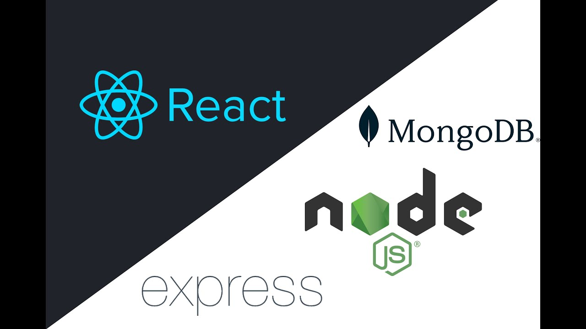

# Todo-list-node.js

## Instalacion
 1. puesdes clonar este repositorio: git@github.com:heisemberghuxley/todo-list-node.js.git
 
## Descripcion

Esta es una API de un todo list desarrollada con Express.js que permite realizar operaciones CRUD (Crear, Leer, Actualizar, Eliminar) en un model que Está diseñado con un enfoque académico para que los aprendices de programación backend puedan utilizarlo como punto de partida y comenzar a trabajar sobre él.

## aaceder desde react ala aplicacion
2. para accaeder a este todo list: en la terminal parado desde la carpeta server en terminal de git bash ejecutando el comando npm start y luego en la terminal del cmd para desde la carpeta cd todo-list-todo-list igualmente ejecutando el comando npm start 

3.puedes eliminar, actualizar y agregar, desde los botones update delete, y add

4. debes crear una cuenta de atlas y conectarla con la app en ese caso debes cambairle la contraseña y el usuario, en el archivo .env borras <loque este aca> y pones tu contraseña

4.puedes verificar lo que esta actualizado o eliminado desde tu cuenta de atlas

5. tambien puedes probar desde postman

## Tecnologias utilizadas
-Node
-Javascript
-Express
-Css
-dotenv
-mongoose
-nodemon
-react

## Contacto 
puesde contactarme amo correo si tines dudas o quieres desarrolar le mismo proyecto en(elhuxley277@gmail.com)