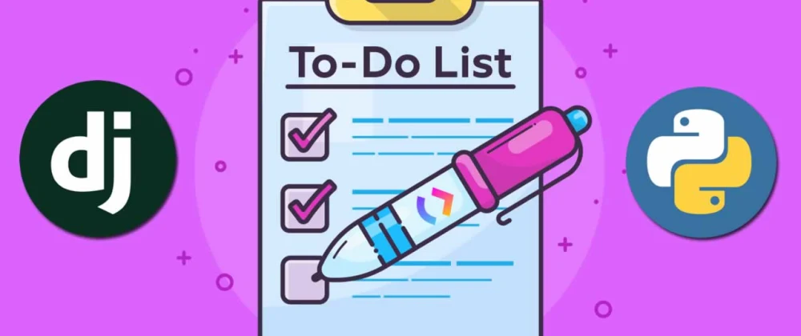

# todo-list-node.js

## Installation
 1. so you can clone this repository: https://github.com/heisemberghuxley/todo-list-node.js.git
 
## Description

This is a todo list API developed with Express.js that allows to perform CRUD (Create, Read, Update, Delete) operations on a model that is designed with an academic approach so that backend programming trainees can use it as a starting point and start working on it.

## to access from react to the application
2. to access this todo-list: in the terminal stop from the server folder in git bash terminal by running the command npm start and then in the cmd terminal stop from the cd todo-list-todo-list folder also by running the command npm start. 

3. you can delete, update and add, from the update delete, and add buttons.

4. you must create an atlas account and connect it with the app in that case you must change the password and the user, in the .env file you delete <what's here> and put your password

4. you can check what is updated or deleted from your atlas account.

5. you can also try from postman

## Technologies used
-Node
-Javascript
-Express
-Css
-dotenv
-mongoose
-nodemon
-react

## Contact 
you can contact me by mail if you have questions or want to develop the same project at(samionli_16@hotmail.com)# node_js
